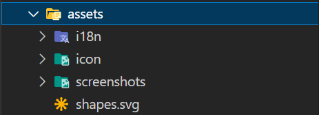
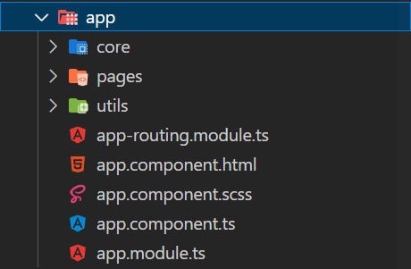

# eTeam Maker

Una aplicación basada en el sistema CRUD y creada mediante ***Ionic Framework***, ***Angular*** , ***Typescript***, ***HTML*** y ***SCSS***.

## ÍNDICE: 
1. [¿Qué es?](#qué-es)
2. [Funcionalidades](#funcionalidades) 
3. [Estructura Interna](#estructura-interna) 

5. [Video Explicativo](#video-explicativo)

## ¿QUÉ ES?

***eTeam Maker*** es una aplicación creada para la creación y gestión deportiva de una liga de deportes electrónicos (eSports) que nos proporcionará información de todo tipo, desde información estadísitca de los jugadores, de los equipos e incluso de movimientos en el mercado de fichajes.

Para entender un poco más la aplicación debemos comprender qué son los eSports:
Los deportes electrónicos, también llamados ciberdeportes o esports, son competiciones de videojuegos que se han convertido en eventos de gran popularidad. Por lo general, los deportes electrónicos son competiciones de videojuegos multijugador, particularmente entre jugadores profesionales (fuente: [Wikipedia](https://es.wikipedia.org/wiki/Deportes_electr%C3%B3nicos)) .

Con este proyecto se pretende facilitar una aplicación que nos ayude con esa gestión y adquirir información dentro de una liga de deportes electrónicos, de forma general, podrías crearla para una liga de cualquier videojuego.

El diseño de la aplicación está realizado para que cualquier persona pueda comprenderlo y utilizarlo además de ser adaptable para cualquier tipo de dispositivo (Móvil, Tablet, Ordenador Personal...) . Este característico diseño se mantiene vigente en cada una de las páginas, conservando la esencia de la propia aplicación.

## FUNCIONALIDADES

- Comenzando por la página de Inicio o Home Page, esta página tiene la funcionalidad especial de poder cambiar entre tres idiomas distintos toda la aplicación, los idiomas son Inglés, Español y Francés. Además, nos proporciona una presentación para comprender la aplicación y finalmente un footer donde podremos acceder a distintos enlaces web.

- Como indica la propia descripción del proyecto. Esta aplicación utiliza el sistema CRUD, que se verá presente en cinco de las siete páginas que contiene la aplicación. Por lo tanto, tiene las funciones de crear, leer, actualizar y borrar datos (*Create, Read, Update, Delete*). Estas funciones son accesibles mediantes las páginas de Jugadores, Equipos, Mercado, Jugadores Favoritos y Equipos Favoritos. Posteriormente explicaremos cada página de forma exclusiva.

- Una funcionalidad a recalcar, que distingue esta aplicación, es la de favoritos. En las páginas CRUD podremos asignar un equipo o un jugador como favoritos, y, en ese momento aparecerán en las páginas Jugadores Favoritos o Equipos Favoritos, donde sólo tendremos los añadidos anteriormente y podremos eliminar de favoritos una vez allí.

- También tenemos la funcion de hacer un contrato entre un jugador y un equipo en la página de Mercado. Podremos seleccionar jugador, equipo y fecha de contratación y agregarlo a la lista visible en está página donde podremos observar otros movimientos en el mercado. Una vez un jugador esté firmado por un equipo no será posible borrarlo a menos que sea eliminado el contrato. Lo mismo pasa con un equipo que tenga jugadores contratados, hasta que no esté borrado el contrato con todos los jugadores no podrá borrarse.

- Finalmente, tenemos la página Acerca de, donde se detalla información sobre la creación del proyecto y su autor.

- Una funcionalidad extra y oculta a ojos del usuario final es la del servicio de Logs, un servicio que nos proporcionará información adicional a la hora de codificar o mantener la aplicación. Está unida a un componente llamado LogComponent, que al ser agregado a cualquier página nos mostrará un botón donde al clickarlo detallará en la consola datos informativos sobre la página.

## ESTRUCTURA INTERNA
En esta sección explicaré la estructura interna del programa, qué directorios y subdirectorios contiene y por qué se ha decidido así.

- Comenzando por el directorio de assets, dentro de este se almacenan tres carpetas: 

  - i18n almacena los archivos JSON de traducción para la aplicación.
  - icons almacena las imágenes que se adjuntan en cada página, así como el favicon de esta.
  - screenshots almacena las capturas de pantalla que se adjuntarán en este README.
  

- Continuamos con la carpeta app, que contiene tres carpetas importantes:

  - Utils: Que almacena un archivo translate.ts que nos facilita el sistema de traducción de la aplicación.
  
  - Pages: Donde se almacenan las páginas principales de la aplicación. He decidido que esta carpeta no debería de ser una carpeta routing general para enlazar cada página debido a que, a mi parecer, se facilita la manipulación de cada página, sus imports, declaraciones y exports si se mantiene de forma independiente en cada página un archivo de routing. Ademas así se diferencian mejor las pages de los componentes en la página y se facilita la gestión general. 

  - Core: Una carpeta que contiene tanto los componentes que se asignarán a las páginas, como los servicios que utilizarán cada componente, y finalmente los modelos que se utilizarán en el sistema CRUD. Esta carpeta sí que tiene el routing conjunto para facilitar la adhesión de cada archivo a una página en concreto.
